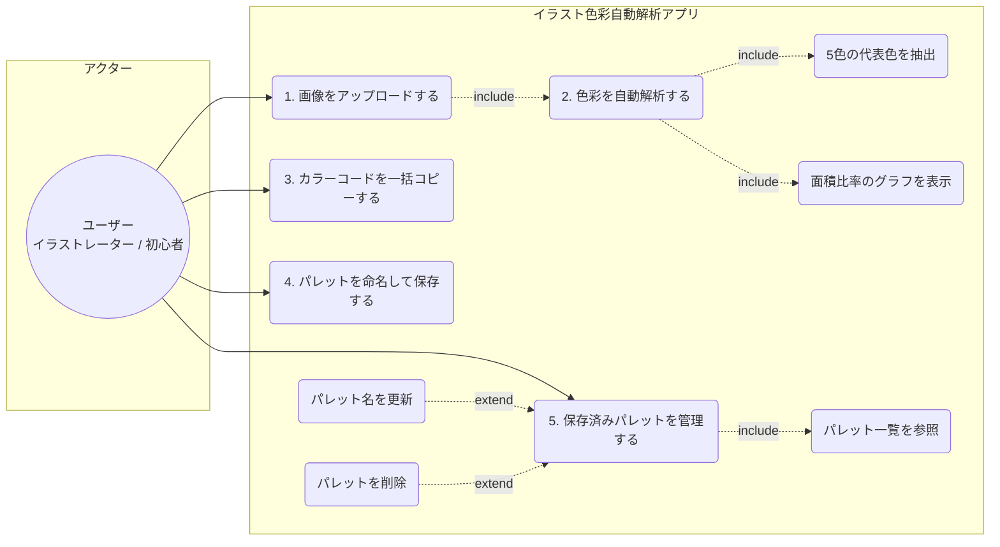
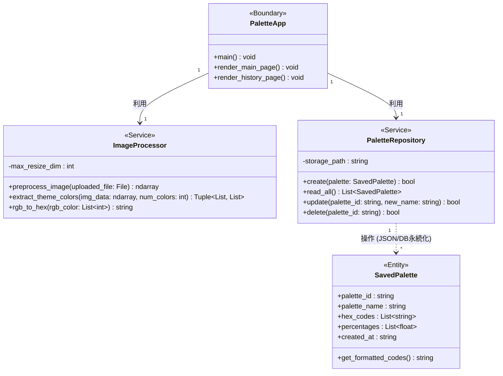
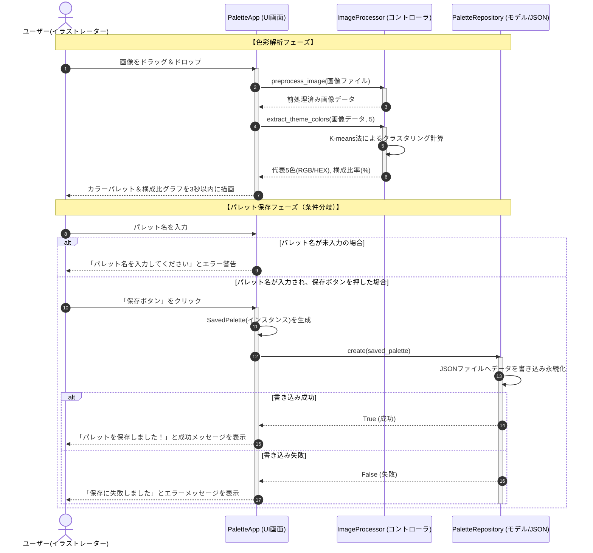
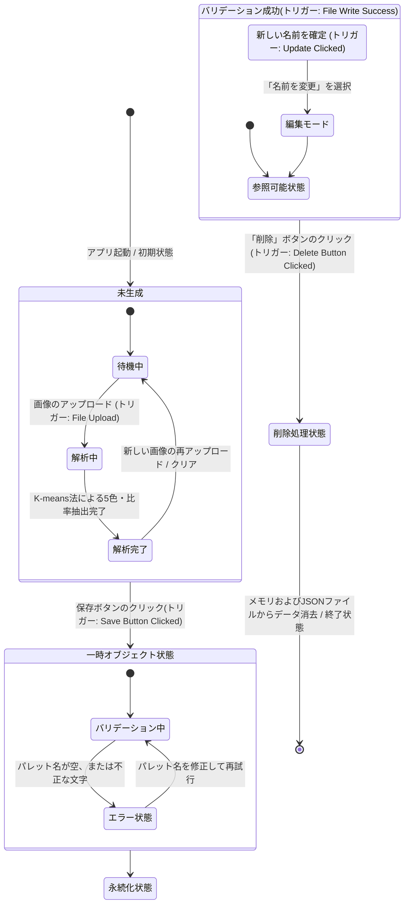

# イラスト色彩自動解析アプリ (Color Palette Analyzer)

イラスト制作における色彩設計の悩みを解決し、客観的なデータに基づいて配色を最適化・ストックできるWebアプリケーションです。

---

## 1. Miro要件マップ（アプリ概要）

| 観点 | 内容 |
| :--- | :--- |
| **目的** | イラスト制作における色彩設計 of 悩み（バランスの悪さや色の偏り）を解決し、客観的なデータに基づいて配色を最適化・研究する。 |
| **利用者** | イラストレーター、デジタルペイント初心者。作品のブラッシュアップ中や、配色に行き詰まった際に使用する。 |
| **入力** | イラスト画像ファイル（jpg, png）、パレットのタイトル（テキスト）。 |
| **出力** | 主要な5色のカラーパレット、各色の構成比グラフ、カラーコード一覧、保存済みパレット一覧。 |
| **主要機能** | 1. 画像のドラッグ＆ドロップ機能<br>2. K-means法による5色の代表色抽出機能<br>3. 各色の面積比率の算出とグラフ表示機能<br>4. カラーコードのクリップボードへの一括コピー機能<br>5. 解析したパレットの保存・一覧参照・名前の更新・削除（CRUD機能） |
| **非目標** | 色の心理的意味のAIによる解釈、画像全体の自動色調補正（自動修正）、複雑なレイヤー解析。 |
| **受け入れ基準**| ・画像をアップロード後、3秒以内にカラーパレットと構成比グラフが正しく描画されること。<br>· カラーコードの一括コピーボタンが正常に機能すること。<br>· 保存したパレットのCRUD操作が正常に行えること。 |

---

## 2. 要件定義書（機能・非機能要求一覧）

### 機能要求（Functional Requirements）
* ユーザーが画像をドラッグ＆ドロップしてアップロードできること。
* システムが自動で画像を解析し、代表5色とそれぞれの構成比率（％）を算出すること。
* 算出された比率を直感的なグラフ（棒グラフまたは円グラフ）で表示すること。
* 抽出したカラーコードをワンクリックで一括コピーできること。
* 解析結果に任意の名前をつけて保存、一覧からの確認、編集、削除ができること。

### 非機能要求（Non-Functional Requirements）
* **性能**: 画像アップロード完了から、カラーパレットおよび構成比グラフの描画完了まで**3秒以内**で処理すること。高解像度画像は内部で自動リサイズして高速化を図る。
* **セキュリティ**: アップロードできる拡張子を `jpg`, `jpeg`, `png` に限定すること。画像ファイルはサーバー等に永続保存せずメモリ上で即時破棄すること。
* **ユーザビリティ**: デザイナーが直感的に使えるよう、一般的なカラーピッカーUIを踏襲すること。
* **保守性**: コードは「前処理」「解析」「描画」「CRUD処理」をそれぞれ独立した関数（モジュール）に分解して実装すること。データは単純なJSON形式等で永続化すること。

---

## 3. COSMIC CFP（機能規模）の見積もり

本アプリケーションの規模をCOSMIC機能規模測定法に基づき見積もります。

* **外部入力 (Entry: 2 CFP)**: 画像のアップロード操作、パレット保存時の名称入力
* **外部出力 (Exit: 3 CFP)**: カラーパレットの描画、構成比グラフの描画、一括コピーの出力
* **読み込み/書き込み (Read/Write: 4 CFP)**: パレットデータの保存(W)、一覧の参照(R)、名称の更新(W)、パレットの削除(W)
* **合計機能規模**: **約 30 ~ 35 CFP** (4週間で個人開発可能な適切な規模感)

---

## 4. 開発環境・使用言語

次週の実装に向けて、以下の軽量かつ高速に開発が可能な環境を採用します。

* **利用言語**: Python 3.10+
* **フレームワーク**: Streamlit (Web UI UI構築用)
* **主要ライブラリ**: 
  * OpenCV / Pillow (画像前処理用)
  * scikit-learn (K-means法によるクラスタリング解析用)
  * Plotly / Matplotlib (構成比グラフ描画用)

---

## 5. アプリケーションの起動方法（動かし方）

### ① 必要ライブラリのインストール
ターミナルで以下のコマンドを実行し、必要なパッケージをインストールします。
```bash
pip install streamlit opencv-python Pillow scikit-learn plotly
```

### ② アプリケーションの起動
リポジトリのルートディレクトリで以下のコマンドを実行し、ローカルサーバーを起動します。
```bash
streamlit run app.py
```
起動後、ブラウザで http://localhost:8501 に自動アクセスされ、アプリが利用可能になります。

---

## 6. 設計図（Mermaid記法による4種の図面）

### ① ユースケース図風


### ② クラス図


### ③ シーケンス図


### ④ 状態遷移図

    
