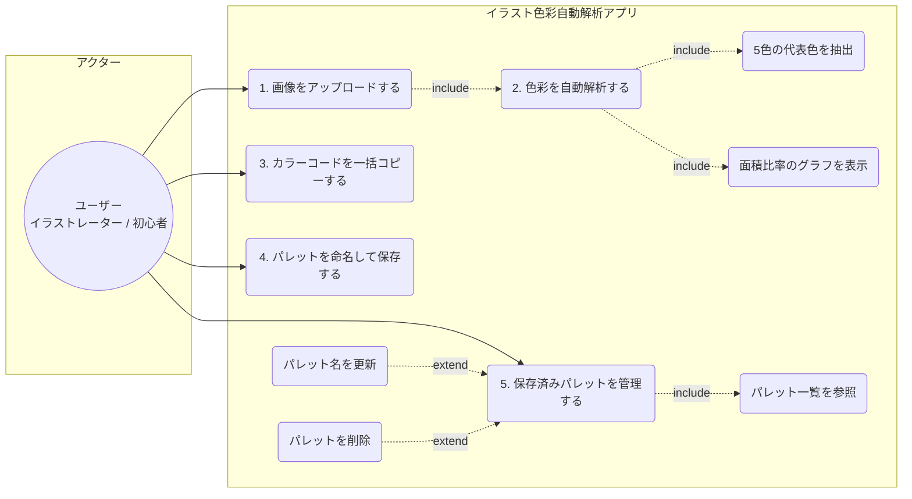
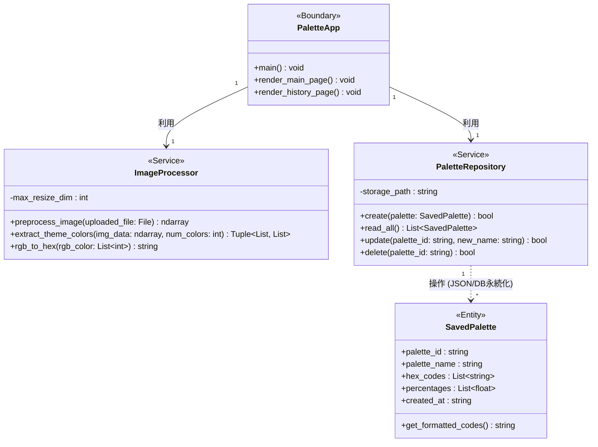
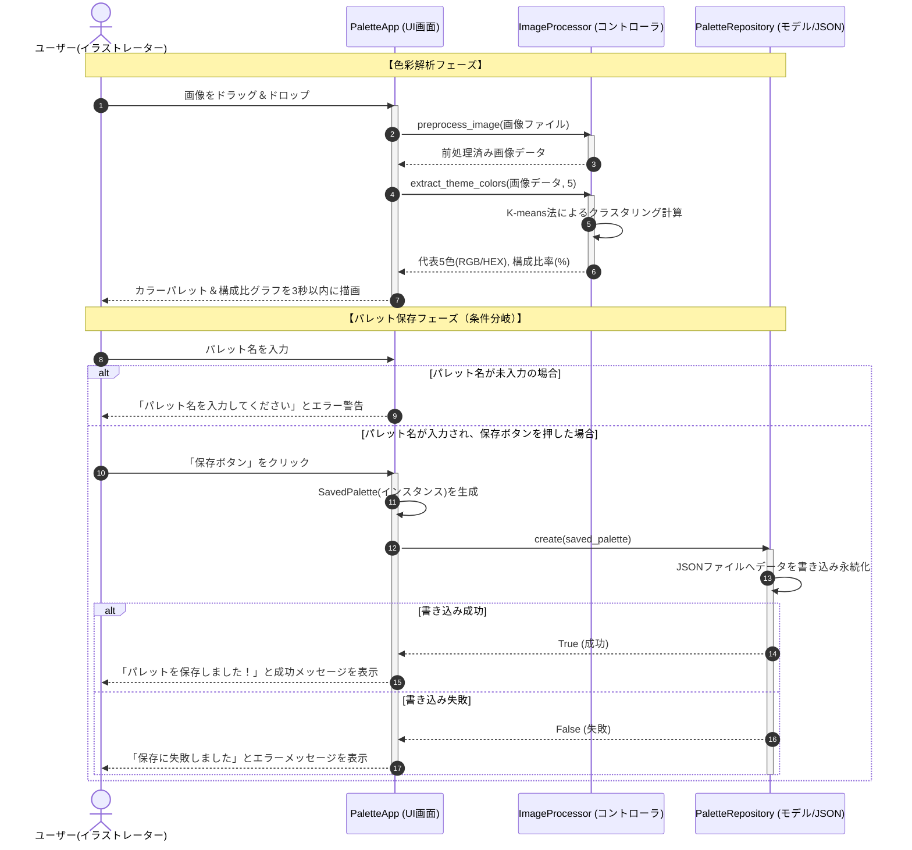
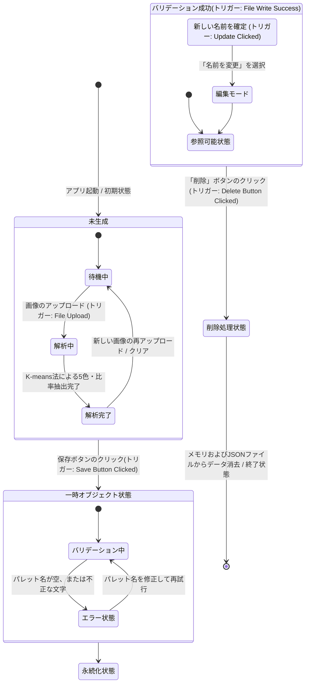

# イラスト色彩自動解析アプリ (Color Palette Analyzer)

イラスト制作における色彩設計の悩みを解決し、客観的なデータに基づいて配色を最適化・ストックできるWebアプリケーションです。

---

## 📌 現在の実装ステータス（今日時点の状態）
- [x] **主要機能①：画像のドラッグ＆ドロップ・プレビュー表示機能【完了】**
- [x] **ユーザー入力のバリデーション（PNG, JPG, JPEG限定）およびエラーハンドリング【完了】**
  - ※ファイル名が短くエラー表示が被るUIバグを独自バリデーションで解消。破損ファイル等の安全な弾き処理を実装。
- [x] **主要機能②：K-means法による代表色抽出機能【本日完了】**
  - ※抽出する色数を3〜10色で自由に調整できるスライダーを実装。
  - ※開発中仕様変更：背景の白・黒・透過部分がノイズにならないよう、「背景色を除外する」チェックボックスを実装。
- [x] **主要機能③：各色の面積比率の算出とPlotlyによるグラフ表示機能【本日完了】**
- [x] **主要機能④：カラーコードのクリップボードへの一括コピー機能【本日完了】**
- [ ] 主要機能⑤：解析したパレットの保存・一覧参照・名前の更新・削除（CRUD機能）（未実装）

---

## 1. Miro要件マップ（アプリ概要）

| 観点 | 内容 |
| :--- | :--- |
| **目的** | イラスト制作における色彩設計 of 悩み（バランスの悪さや色の偏り）を解決し、客観的なデータに基づいて配色を最適化・研究する。 |
| **利用者** | イラストレーター、デジタルペイント初心者。作品のブラッシュアップ中や、配色に行き詰まった際に使用する。 |
| **入力** | イラスト画像ファイル（jpg, png）、パレットのタイトル（テキスト）。 |
| **出力** | 主要な5色のカラーパレット、各色の構成比グラフ、カラーコード一覧、保存済みパレット一覧。 |
| **主要機能** | 1. 画像のドラッグ＆ドロップ機能<br>2. K-means法による5色の代表色抽出機能<br>3. 各色の面積比率の算出とグラフ表示機能<br>4. カラーコードのクリップボードへの一括コピー機能<br>5. 解析したパレットの保存・一覧参照・名前の更新・削除（CRUD機能） |
| **非目標** | 色の心理的意味のAIによる解釈、画像全体の自動色調補正（自動修正）、複雑なレイヤー解析。 |
| **受け入れ基準**| ・画像をアップロード後、3秒以内にカラーパレットと構成比グラフが正しく描画されること。<br>· カラーコードの一括コピーボタンが正常に機能すること。<br>· 保存したパレットのCRUD操作が正常に行えること。 |

---

## 2. 要件定義書（機能・非機能要求一覧）

### 機能要求（Functional Requirements）
* ユーザーが画像をドラッグ＆ドロップしてアップロードできること。
* システムが自動で画像を解析し、代表5色とそれぞれの構成比率（％）を算出すること。
- ユーザーの選択により、背景の白・黒を解析対象から除外できるチェックボックスを設けること。**【仕様追加】**
* 算出された比率を直感的なグラフ（棒グラフまたは円グラフ）で表示すること。
* 抽出したカラーコードをワンクリックで一括コピーできること。
* 解析結果に任意の名前をつけて保存、一覧からの確認、編集、削除ができること。

### 非機能要求（Non-Functional Requirements）
* **性能**: 画像アップロード完了から、カラーパレットおよび構成比グラフの描画完了まで**3秒以内**で処理すること。高解像度画像は内部で自動リサイズして高速化を図る。
* **セキュリティ**: アップロードできる拡張子を `jpg`, `jpeg`, `png` に限定すること。画像ファイルはサーバー等に永続保存せずメモリ上で即時破棄すること。
* **ユーザビリティ**: デザイナーが直感的に使えるよう、一般的なカラーピッカーUIを踏襲すること。
* **保守性**: コードは「前処理」「解析」「描画」「CRUD処理」をそれぞれ独立した関数（モジュール）に分解して実装すること。データは単純なJSON形式等で永続化すること。

---

## 3. COSMIC CFP（機能規模）の見積もり

本アプリケーションの規模をCOSMIC機能規模測定法に基づき見積もります。

* **外部入力 (Entry: 2 CFP)**: 画像のアップロード操作、パレット保存時の名称入力
* **外部出力 (Exit: 3 CFP)**: カラーパレットの描画、構成比グラフの描画、一括コピーの出力
* **読み込み/書き込み (Read/Write: 4 CFP)**: パレットデータの保存(W)、一覧の参照(R)、名称の更新(W)、パレットの削除(W)
* **合計機能規模**: **約 30 ~ 35 CFP** (4週間で個人開発可能な適切な規模感)

---

## 4. 開発環境・使用言語

次週の実装に向けて、以下の軽量かつ高速に開発が可能な環境を採用します。

* **利用言語**: Python 3.10+
* **フレームワーク**: Streamlit (Web UI UI構築用)
* **主要ライブラリ**: 
  * OpenCV / Pillow (画像前処理用)
  * scikit-learn (K-means法によるクラスタリング解析用)
  * Plotly / Matplotlib (構成比グラフ描画用)

---

## 5. アプリケーションの起動方法（動かし方）

### ① 必要ライブラリのインストール
ターミナルで以下のコマンドを実行し、必要なパッケージをインストールします。
```bash
pip install streamlit opencv-python Pillow scikit-learn plotly
```

### ② アプリケーションの起動
リポジトリのルートディレクトリで以下のコマンドを実行し、ローカルサーバーを起動します。
```bash
streamlit run app.py
```
起動後、ブラウザで http://localhost:8501 に自動アクセスされ、アプリが利用可能になります。

### ③ 動作確認

#### 📅 6/25: テスト項目（初期実装チェック）
1. ブラウザでアプリを開き、タイトル「🎨 Color Palette Analyzer」および「※一度にアップロードできるイラストは1枚のみです」というユーザー向けの注意書きが正しく表示されているか確認。
2. 正常系テスト：手元の画像（PNG/JPG）をアップロードし、画面にイラストがプレビューされ、「✅ 画像の読み込みに成功しました！」と緑色のメッセージが出るか確認。
3. 異常系テスト：対応外のファイルを投入した際、Python側のバリデーションロジックで安全に弾かれることを確認。
   - ※技術的アプローチ（リファクタリング成果）：当初、Streamlit標準のファイル制限機能（`type`引数）を使用していた際、「ファイル名が短い」かつ「エラーメッセージが長い」条件でエラー文が「×（削除）」ボタンに被って操作不能になるUIバグを発見。
   - この欠陥を回避するため、あえて制限を外してPython側で拡張子を完全自前チェックするロジック（解決策A）へリファクタリングを行い、メッセージの被りをプログラム側で根本解決済み。

#### 📅 7/7: テスト結果（品質保証フェーズ完了）
主要ロジック（色彩抽出・比率計算・グラフ描画）の実装完了に伴い、3つの視点（正常系・境界値・異常系）から**合計24件のテストケース**を実行し、**全て合格（通過率100%）**を達成して製品品質を確保しました。

##### 📊 テスト実施サマリー
* **実行日**: 2026年7月7日
* **テスト総数**: 24件 / **合格**: 24件 （不合格: 0件）
* **テスト通過率**: 100%

##### 🛠️ 発見された不具合と対応（バグフィックス成果）
1. **単色画像入力時のクラッシュ（異常系）**
   * **症状**: 有効な色数が指定数未満（単色や完全透過など）の画像を分析すると、KMeansの空クラスタ発生により配列長が不一致となりアプリがクラッシュする。
   * **対応**: クラスタリング結果の空チェックおよび長さを補正するロジックを追加。安全に処理をハンドリングし、「⚠️ 有効なピクセルが不足しています」という警告メッセージを表示する仕様へ改善。
2. **非対応ファイル投入時のUI表示崩れ（異常系）**
   * **症状**: Streamlit標準の `type` 引数による拡張子制限では、ファイル名が短いファイルをドロップした際、エラー警告文が長すぎて「× (削除)」ボタンに被ってしまい、操作不能になるUI欠陥が発生。
   * **対応**: 標準の制限をあえて外し、Python（Pillow）側で拡張子を完全自前チェックするロジックへリファクタリング。UIを崩すことなく、画面下部にクリアな独自エラー（「❌ PNG, JPG, JPEG以外のファイルです」）を表示させることで根本解決。
3. **例外ハンドリングの厳密化（異常系）**
   * **症状**: 単なる拡張子違いと、ファイル自体の破損（壊れた画像）の区別が曖昧だった。
   * **対応**: `Image.verify()` による破損チェックを組み込み、破損ファイルには「❌ 画像の読み込みに失敗しました。」と適切な対処法を明示するようハンドリングを細分化。

##### 📝 テストケース実行結果詳細

| # | テスト対象 | 観点 | テスト条件 | テスト手順(1行) | 期待値(1行) | 結果 |
|---|---|---|---|---|---|---|
| 1 | 画像アップロード | 正常系 | 一般的なPNG画像の入力 | 一般的なイラスト画像(.png)をドラッグ＆ドロップしてアップロードする | 画像がプレビュー表示され、「✅ 画像の読み込みに成功しました！」と表示されること | ○ |
| 2 | 画像アップロード | 正常系 | 一般的なJPG画像の入力 | 一般的なイラスト画像(.jpg)をドラッグ＆ドロップしてアップロードする | 画像がプレビュー表示され、成功メッセージが表示されること | ○ |
| 3 | 画像アップロード | 正常系 | 一般的なJPEG画像の入力 | 一般的なイラスト画像(.jpeg)をドラッグ＆ドロップしてアップロードする | 画像がプレビュー表示され、成功メッセージが表示されること | ○ |
| 4 | 画像アップロード | 境界入力 | 大文字拡張子の入力 | 拡張子が大文字の画像(.PNGなど)をアップロードする | 小文字に変換して判定され、正常に読み込まれること | ○ |
| 5 | 画像アップロード | 境界入力 | 特殊なファイル名の入力 | ファイル名に日本語やスペースを含む画像（例：「テスト 画像.png」）をアップロードする | エラーにならず正常に読み込まれること | ○ |
| 6 | 抽出機能（基本） | 正常系 | デフォルト設定での実行 | 画像アップロード後、設定を変えずに「✨ 色彩を分析する」ボタンを押す | 分析中スピナーが表示された後、5色のパレットと円グラフが表示されること | ○ |
| 7 | 抽出機能（色数） | 正常系 | 色数を変更して実行 | スライダーを「7」に設定し、「✨ 色彩を分析する」ボタンを押す | 抽出結果のカラーパレットと円グラフが7色分表示されること | ○ |
| 8 | 抽出機能（色数） | 境界入力 | 色数スライダーの最小値 | スライダーを最小値の「3」に設定し、「✨ 色彩を分析する」ボタンを押す | 抽出結果のカラーパレットと円グラフが3色分表示されること | ○ |
| 9 | 抽出機能（色数） | 境界入力 | 色数スライダーの最大値 | スライダーを最大値の「10」に設定し、「✨ 色彩を分析する」ボタンを押す | 抽出結果のカラーパレットと円グラフが10色分表示されること | ○ |
| 10 | 抽出機能（白黒除外） | 正常系 | 白黒除外OFFでの実行 | 「背景の白・黒を除外する」のチェックを外し、白背景の画像を分析する | 抽出されたパレットの中に、背景の白に近い色が含まれること | ○ |
| 11 | 抽出機能（白黒除外） | 正常系 | 白黒除外ONでの実行 | 「背景の白・黒を除外する」のチェックを入れ、白や黒の背景を持つ画像を分析する | 抽出されたパレットから白や黒が除外され、キャラクター等の構成色が抽出されること | ○ |
| 12 | 抽出機能（透過） | 正常系 | 透過PNGの分析 | キャラクターのみで背景が透明なPNG画像をアップロードして分析する | 透明部分（黒として扱われがちな部分）が計算から除外され、キャラクターの色のみが抽出されること | ○ |
| 13 | 画像サイズ | 境界入力 | 巨大な画像の入力 | 4K解像度以上などのファイルサイズが大きい画像をアップロードして分析する | 内部でリサイズ処理が行われ、数秒以内に分析が完了すること | ○ |
| 14 | 画像サイズ | 境界入力 | 極小画像の入力 | 150x150ピクセル未満の非常に小さい画像をアップロードして分析する | エラーで落ちることなく、正常に分析結果が表示されること | ○ |
| 15 | パレット表示 | 正常系 | カラーコードのコピー | 抽出されたカラーパレットの下に表示されるカラーコード（#XXXXXX）の右上のコピーボタンをクリックする | クリップボードに該当のカラーコードが正しくコピーされること | ○ |
| 16 | 円グラフ表示 | 正常系 | 円グラフの構成確認 | 抽出完了後、表示されたドーナツチャートの色と分割数を確認する | 抽出されたカラーパレットと同じ色・数でグラフが構成されていること | ○ |
| 17 | 円グラフ表示 | 正常系 | ホバー情報の確認 | 円グラフの任意のセグメントにマウスカーソルを合わせる | 該当するカラーコードとその色が占める割合（%）がツールチップで表示されること | ○ |
| 18 | 再解析 | 正常系 | 別画像への切り替え | 一度分析を完了させた後、ファイルアップローダーの「×」ボタンで画像を消し、別の画像をアップロードして分析する | 新しい画像に対する正しい抽出結果（パレットと円グラフ）で画面が上書きされること | ○ |
| 19 | 異常系対応 | 異常系 | 非対応拡張子のアップロード | ドラッグ＆ドロップで強制的に .gif や .txt ファイルをアップロードする | 画面下部に「❌ PNG, JPG, JPEG以外のファイルです。」と自前エラーが表示されクラッシュしないこと | ○ |
| 20 | 異常系対応 | 異常系 | 有効色が足りない画像の入力（単色） | 「真っ赤」などの単色画像をアップロードし、色数を10にして分析ボタンを押す | KMeansアルゴリズムがエラーで落ちず、「⚠️ 有効なピクセルが不足しています」という警告が表示されること | ○ |
| 21 | 異常系対応 | 異常系 | 全て除外される画像の入力（白黒） | 真っ白（または真っ黒）の画像をアップロードし、白黒除外ONのまま分析する | 有効ピクセルがなくなり、「⚠️ 有効なピクセルが不足しています」という警告が表示されること | ○ |
| 22 | 異常系対応 | 異常系 | 全て除外される画像の入力（完全透過） | ピクセルが全て透明な画像をアップロードして分析する | 有効ピクセルがなくなり、「⚠️ 有効なピクセルが不足しています」という警告が表示されること | ○ |
| 23 | 異常系対応 | 異常系 | 破損ファイルの入力 | 拡張子だけ.pngに変更した無効なファイルや、意図的に破損させた画像ファイルをアップロードする | 「❌ 画像の読み込みに失敗しました。」というエラーが表示され、アプリ全体がクラッシュしないこと | ○ |
| 24 | UI操作 | 正常系 | 画像なしでのボタン押下試行 | アプリ起動直後、画像をアップロードしていない状態を確認する | 画像がアップロードされるまで「✨ 色彩を分析する」ボタン等の抽出設定UIが表示されていないこと | ○ |
---

## 6. 設計図（Mermaid記法による4種の図面）

### ① ユースケース図風


### ② クラス図


### ③ シーケンス図


### ④ 状態遷移図

    
